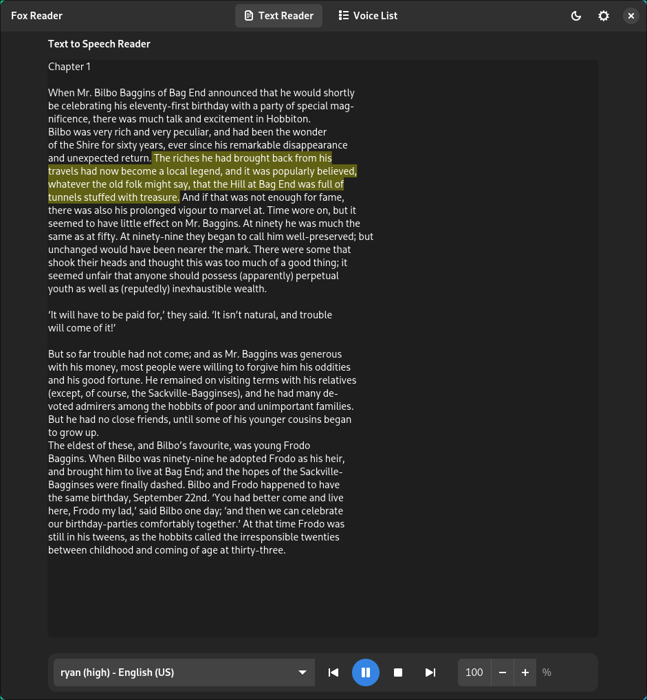

# Fox Reader

Fox Reader is a simple text-to-speech application built in Rust and GTK4 that
converts text to speech using all voices from
[piper voices](https://huggingface.co/rhasspy/piper-voices).

## Why I've built it?

While other applications offer Piper voice integration with Speech Dispatcher, I
wanted a little bit more, also non of them seems to work with firefox
`Read aloud` functionallty, so I decided to build this small GTK application.

## Key Features

1. Text-to-speech with highlighting system
2. Pdf Reader 
3. Abbility to talk to LLM's with your voice
4. Speech Dispatcher compatibility
5. Firefox Read Aloud integration

## Current UI:




## Prerequisites

- GTK4 and its development libraries
- Speech Dispatcher (optional)
- Pdfium (optional - if missing will be installed)
- Rust toolchain (for building from source)

## Installation

### From Release

1. Download the latest release:

```bash
wget https://github.com/kopecmaciej/fox-reader/releases/download/v0.1.0/fox-reader-v0.1.0.tar.gz
tar -xzf fox-reader-v0.1.0.tar.gz
mv fox-reader ~/.local/bin/
rm fox-reader-v0.1.0.tar.gz
```

2. Run the application:

```bash
fox-reader
```

### Building from Source

1. Clone the repository:

```bash
# Clone repository
git clone https://github.com/kopecmaciej/fox-reader.git
cd fox-reader

# Build
cargo build --release

# Run
./target/release/fox-reader
```

## Usage

### Voice Management

1. Open the `Voice List` tab
2. Browse available voices from the Piper voices repository
3. Download desired voices, every downloaded voice is avaliable in `Text Reader`
   and `Speech Dispatcher`
4. Set favorite voice as default for better `Speech Dispatcher` experience

### Speech Dispatcher Integration

Fox Reader integrates with Speech Dispatcher through a custom output module
script that processes audio using various players (mpv, ffplay, sox with aplay
or paplay). The script handles:

- Dynamic audio player selection based on system availability
- Speech rate adjustments for Firefox compatibility
- Volume control and audio processing
- Raw audio stream handling from Piper TTS

### Audio Player Support

The script automatically selects the first available player in this order:

- mpv (recommended) - Supports speed control and volume adjustment
- ffplay - Basic playback with volume control
- sox - Advanced audio processing with tempo adjustment
- aplay/paplay - Basic audio output

## Development Status

- Audio processor improvements for better voice quality at higher speeds
- PDF file support (experimental)
- Move to other GUI rust library for better support on Macos/Windows (probably
  as separate project)

## Contributing

Contributions are welcome! Please feel free to submit a Pull Request.

## Acknowledgments

- [Piper Voices](https://huggingface.co/rhasspy/piper-voices) for providing the
  TTS voices
- [GTK4 team for the UI framework](https://www.gtk.org/)
- [Speech Dispatcher project](https://freebsoft.org/speechd)
