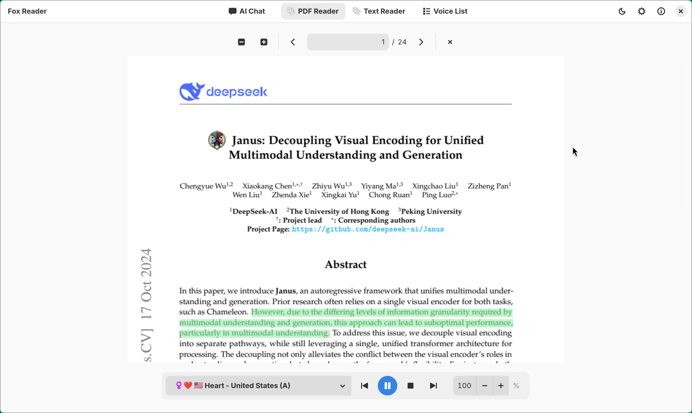
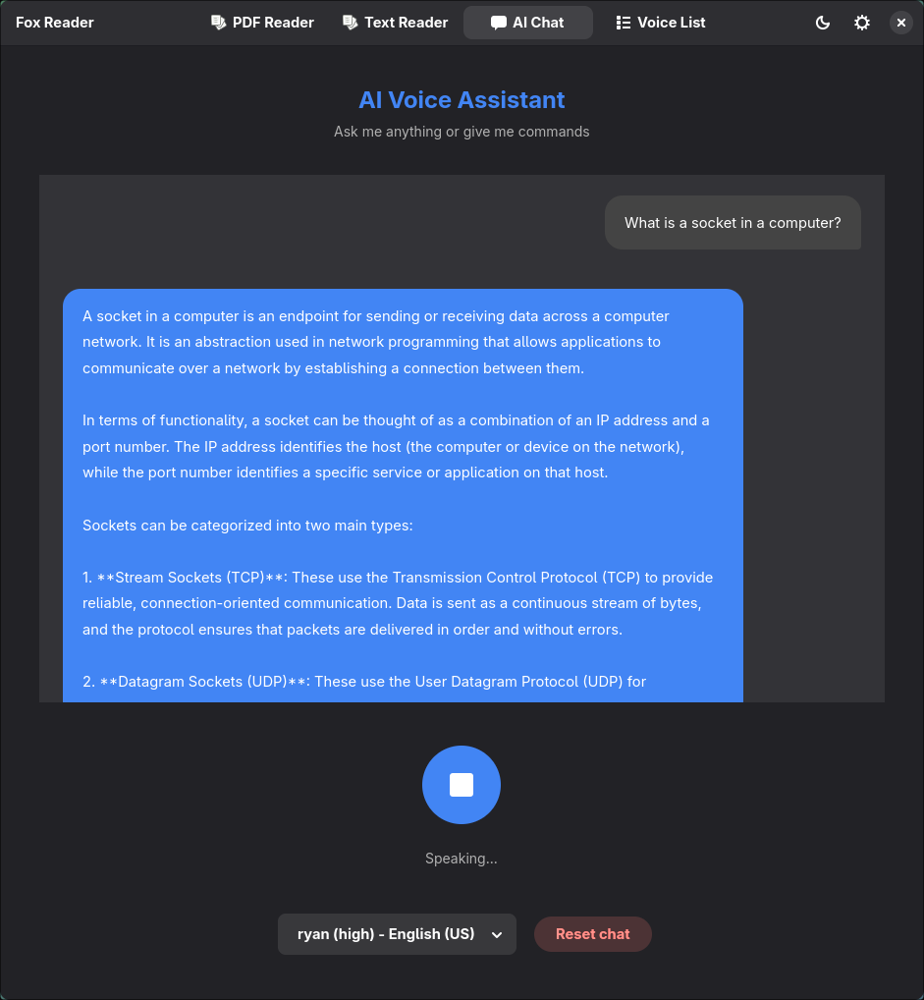

# Fox Reader

Fox Reader is a simple text-to-speech application built in Rust and GTK4 that
converts text to speech using all voices from
[piper voices](https://huggingface.co/rhasspy/piper-voices).

## Current UI:






## Why I've built it?

While other applications offer Piper voice integration with Speech Dispatcher, I
wanted a little bit more, also non of them seems to work with firefox
`Read aloud` functionallty, so I decided to build this small GTK application.

## Key Features

1. **PDF Reader with Highlighting System**
   - Read PDF documents with real-time text highlighting
   - Choose from where to start reading

2. **AI Chat with LLM Integration**
   - Connect to AI models via API keys (OpenAI, etc.)
   - Use local LLM solutions (Ollama/LM Studio)
   - Voice-to-text capability using Whisper models

3. **Text-to-Speech with Highlighting System**
   - Convert any text to natural-sounding speech

4. **Speech Dispatcher Compatibility**
   - Seamless integration with Linux accessibility tools
   - Works with system-wide speech services

5. **Firefox Read Aloud Integration**
   - Works directly with Firefox's built-in reading feature
   - Use voices downloaded via app

## Prerequisites

- **Operating Systems**: Primarily Linux-based distributions
- **GTK4** and its development libraries
- **Rust toolchain** (for building from source)
- **Speech Dispatcher** for reading via spd-say or browser (optional)
- **Pdfium** for PDF Reader (optional - if missing will be installed)
- **Whisper model** for AI Chat (optional - if missing will be installed)

### Dependency Installation (Ubuntu/Debian)

```bash
sudo apt install libgtk-4-dev libspeechd-dev
```

### Dependency Installation (Fedora)

```bash
sudo dnf install gtk4-devel speech-dispatcher-devel
```

### Dependency Installation (Arch Linux)

```bash
sudo pacman -S gtk4 speech-dispatcher
```

## Installation

### *IMPORTANT Workaround until full build will be enabled*

```bash
curl -O https://raw.githubusercontent.com/kopecmaciej/fox-reader/refs/heads/master/resources/com.github.kopecmaciej.Settings.gschema.xml
mkdir $HOME/.local/share/glib-2.0/schemas/ -p
mv com.github.kopecmaciej.Settings.gschema.xml $HOME/.local/share/glib-2.0/schemas/
glib-compile-schemas $HOME/.local/share/glib-2.0/schemas/
```

### From Release

1. Download the latest release:

```bash
wget https://github.com/kopecmaciej/fox-reader/releases/download/v0.1.0/fox-reader-v0.1.0.tar.gz
tar -xzf fox-reader-v0.1.0.tar.gz
mv fox-reader ~/.local/bin/
rm fox-reader-v0.1.0.tar.gz
```

2. Run the application:

```bash
fox-reader
```

### Building from Source

1. Clone the repository:

```bash
# Clone repository
git clone https://github.com/kopecmaciej/fox-reader.git
cd fox-reader

# Build
cargo build --release

# Run
./target/release/fox-reader
```

## Usage

### Voice Management

1. Open the `Voice List` tab
2. Browse available voices from the Piper voices repository
3. Download desired voices, every downloaded voice is avaliable in `PDF Reader`, `Text Reader`
   and `Speech Dispatcher`
4. Set favorite voice as default for `Speech Dispatcher` usage without specified model

### Speech Dispatcher Integration

Fox Reader integrates with Speech Dispatcher through via app cli mode.
Special script located in `~/.config/speech-dispatcher/fox-reader.sh`
will forward data and options properly. If `Fox Reader` is missing in 
`$PATH` you have to specify location by yourself in script.

### CLI Usage

Fox Reader can be used via command line interface for quick text-to-speech conversion without launching the GUI.

#### Basic Command Structure

```bash
fox-reader --cli --model <MODEL_PATH> --text <TEXT> [--rate <RATE>] [--output <OUTPUT_PATH>]
```

#### Required Arguments

- `--cli`: Run in CLI mode without launching the GUI
- `--model` or `-m`: Path to the Piper model directory (must point to a .onnx.json file)
- `--text` or `-t`: Text to synthesize

#### Optional Arguments

- `--rate` or `-r`: Speech rate adjustment (-100 to 100)
  - Negative values slow down speech
  - Positive values speed up speech
- `--output` or `-o`: Path to save the audio output in WAV format
  - If not specified, audio will play immediately

#### Examples

**Play speech immediately:**
```bash
fox-reader --cli --model ~/.local/share/fox-reader/voices/en_US-ryan-high.onnx.json --text "Hello, this is Fox Reader speaking."
```

**Adjust speech rate:**
```bash
fox-reader --cli --model ~/.local/share/fox-reader/voices/en_US-ryan-high.onnx.json --text "This is faster speech." --rate 20
```

**Save to file instead of playing:**
```bash
fox-reader --cli --model ~/.local/share/fox-reader/voices/en_US-ryan-high.onnx.json --text "This will be saved to a file." --output ~/output.wav
```

## Configuration

Fox Reader uses GSettings for storing user preferences and configuration options. These settings include:

- UI theme and appearance preferences
- Default speech parameters
- Window size and position
- Selected voice preferences
- AI chat configuration (model selection, api keys, temperature settings)

You can view and modify these settings using the built-in preferences dialog or through the gsettings command-line tool. All other assets like voices, the pdfium library, and whisper models are stored separately in ~/.local/share/fox-reader/.

## Troubleshooting

### Common Issues

1. **Voice download fails**
   - Check your internet connection
   - Ensure you have write permissions to the voices directory

2. **PDF reader doesn't load**
   - Make sure pdfium is installed or let Fox Reader install it automatically
   - Check if the PDF file is not corrupted or password-protected

3. **Speech Dispatcher integration issues**
   - Verify Speech Dispatcher is installed and running
   - Check the configuration in `~/.config/speech-dispatcher/`

## Development Status

### Current Focus

- Improve performance for better user experience on slow PCs
- Enhance the PDF reader with better text extraction
- Optimize voice processing for lower latency

### Future Considerations

- Experiment with higher-quality voice models
- Consider migration to another GUI Rust library for better cross-platform support
- Expand AI chat functionality

## Contributing

Contributions are welcome! Please feel free to submit a Pull Request.

## Acknowledgments

- [Piper Voices](https://huggingface.co/rhasspy/piper-voices) for providing the
  TTS voices
- [GTK4 team](https://www.gtk.org/) for the UI framework
- [Speech Dispatcher project](https://freebsoft.org/speechd)
- [Pdfium-render](https://github.com/ajrcarey/pdfium-render) After using multiple crates that works with PDF's this one seems the best
- [Piper-rs](https://github.com/thewh1teagle/piper-rs) for simple integration with Piper voices
- [Whisper-rs](https://github.com/tazz4843/whisper-rs) seamless integration with Whisper models.
